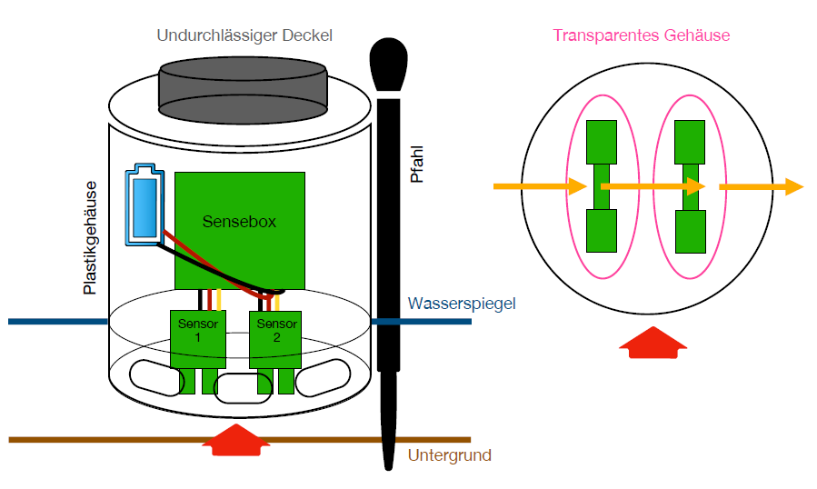
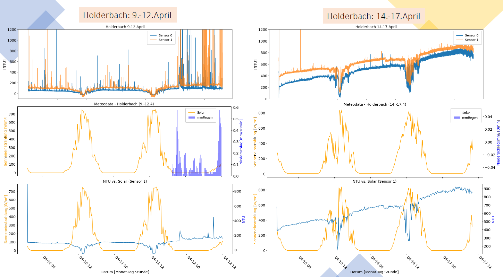
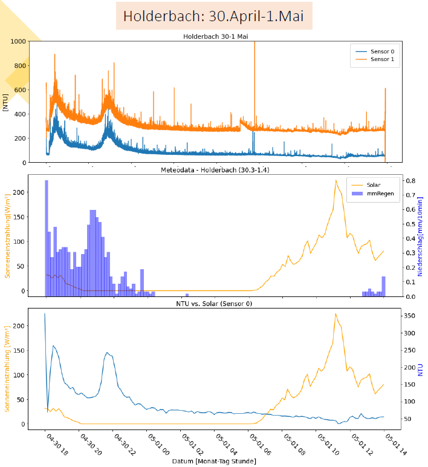
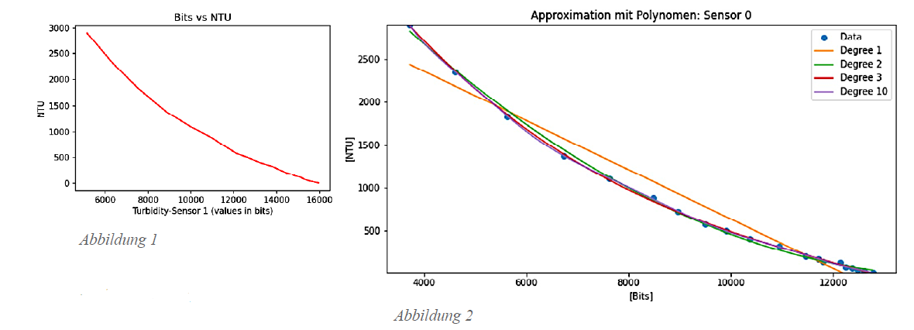
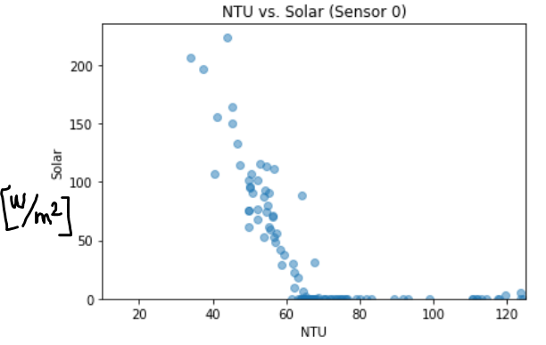

# 🍼babyturbidity

## Introduction
This repo is dedicated to the baby turbidity sensor. This sensor compromises on accuracy for low-cost and it was developed for a class on environmental sensing.

#### Description of the device

This very simple turbidity sensor consists of the [DFRobot turbidity probe](https://www.dfrobot.com/product-1394.html), it is housed in a very simple PVC housing, and it's programmed in the Arduino framework. The "anatomy" of the sensor is shown in the figure below (forgive the German). The senseBox and batteries (figure below - LEFT) are inside of a home-made PVC housing and the housing was closed with a big cork (not the best for waterproofing). The DFRobot probes are housing in a transparent housing and these transparent plastic pieces were glued to our PVC housing (figure below - RIGHT ... I wish I had a better photo of this but I don't). This was done so that the turbidity probes can be directly connected to the senseBox while staying dry and still taking measurements through the small DFRobot transparent housings. 

#### Example results

## BOM

| Item name  | link | Quantity |
| ------------- | ------------- |------------- |
| DF robot turbidity sensor  | https://www.dfrobot.com/product-1394.html  | 2 |
| Adafruit ADS1115 16BIT  | https://www.digikey.ch/de/products/detail/adafruit-industries-llc/1085/5761229  | 2 |
| senseBox MCU | https://sensebox.de/en/products-parts.html | 1 |
| GPS receiver | https://sensebox.shop/product/gps | 1 |
| SD bee | https://sensebox.shop/product/sd-bee | 1 |
| Illumination sensor (option - this data was already provided for the students) | https://sensebox.shop/product/licht-sensor | 1 |
| Battery pack | | 1 |
| AA batteries | | 3 |

## Code
The senseBox uses the Arduino framework so the Arduino library is a good place to start with example codes for [SD card usage](https://github.com/arduino-libraries/SD). Or the Adafruit library for the [ADC](https://github.com/adafruit/Adafruit_ADS1X15). SenseBox also has example codes for each of their products. But I have also included the (very basic) code that we uploaded to this turbidity sensor.

## Calibration
To calibrate the sensor(s), follow the procedure outlined in the folder Calibration. Below you can see an example of the calibration curve our students obtained (LEFT) and the polynomials they fitted to their curves (RIGHT).

## Correlation with sunlight
As the figure below demonstrates, these cheap DF robot sensors are affected by sunlight which is why we calibrate in dark-room conditions (please forgive my hand-drawn units... the students forgot to add the units and I don't have access to the original figure).

## Other problems
- This sensor doesn't have a wiper so biofauling would be a problem and the sensor shouldn't be installed long-term without regular maintenance
- The cork isn't the best for a waterproof housing

## Contact
For questions, please email me at droujko@ifu.baug.ethz.ch or @rivertechjess on Twitter :bird:
